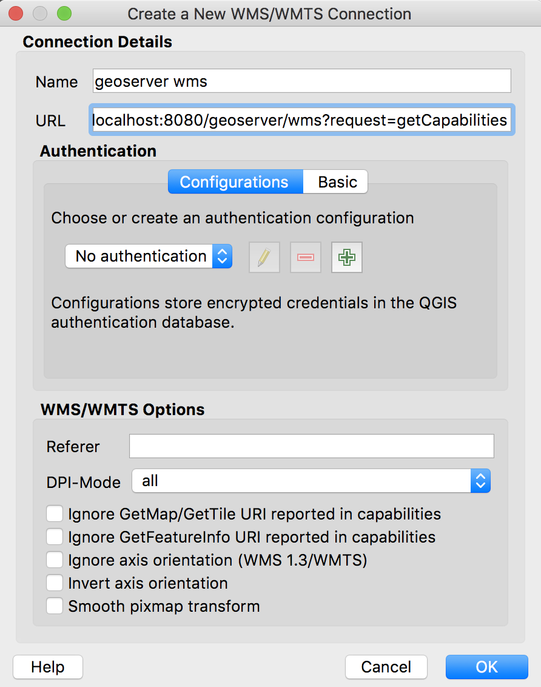

# Assignment: Geoserver I
## Worth: 40 points
## Due: Monday, April 15, 11:59pm

## Assignment

1) Read the background material
2) Answer the questions by adding your responses to [QUESTIONS.md](QUESTIONS.md) in a branch named `geoserver`
3) Submit a Pull Request containing your updated `QUESTIONS.md` and send a Slack message to your instructor

### Obective: Install Geoserver and Become Familiar with its Web Administration GUI

#### Background Reading

##### Open Geospatial Consortium and Geospatial Data Standards
- [Open Geospatial Consortium](https://en.wikipedia.org/wiki/Open_Geospatial_Consortium)
- [OGC Video](http://www.opengeospatial.org/about)
- [WFS](https://en.wikipedia.org/wiki/Web_Feature_Service)
- [WMS](https://en.wikipedia.org/wiki/Web_Map_Service)
- [SLD](https://en.wikipedia.org/wiki/Styled_Layer_Descriptor)

##### Geoserver Docs
- [Installation](https://docs.geoserver.org/stable/en/user/index.html#installation)
- [Web administration interface]https://docs.geoserver.org/stable/en/user/index.html#web-admin)
- [Data management](https://docs.geoserver.org/stable/en/user/index.html#data)
- [Styling](https://docs.geoserver.org/stable/en/user/index.html#styling)
- [Services](https://docs.geoserver.org/stable/en/user/index.html#services)
- [Filtering](https://docs.geoserver.org/stable/en/user/index.html#filtering)

### Instructions
#### Connecting to geoserver with WMS
To get a jump start on using geoserver, it will be helpful to peek under the hood at the OGC requests that are the heart of all interactions between geoserver and clients. By clients, these usually refer to desktop GIS users using QGIS or ArcMap or, more frequently, server or client-side programs that are rendering maps for clients of their own. 

In the left-hand geoserver menu, find `Demos` near the bottom. In the page that comes up, a number OGC demo requests are available for viewing and interacting with. We just want the WMS GetCapabilities to start with. 

In the drop-down menu, find `WMS_getCapabilities.url`.

Note the URL. 
#### Q1: What is the URL of the WMS GetCapabilities request?

You’ll need this. Click Submit. Look at the result. Hard to read, right? Copy the URL and paste it into another window in your browser. 

Notice this an XML file. This the `contract` that the WMS service uses to tell clients what its capabilities are. This includes what data is provides, what projections it supports, what data formats it outputs, etc. The format of this XML document is outlines in the OGC doc: https://portal.opengeospatial.org/files/?artifact_id=38867. There is a `getCapabilities` request for all the OGC services, including WFS and WCS.

Since this is a standard way of conveying to clients the data and services an OGC-compliant service provides, it is no surprise that QGIS can read this natively. 

Open QGIS. 

QGIS has been programmed to be able to parse this `getCapabilities` request to know what layers are available to issue requests for. 

Navigate to the `Layers` (menu item) -> `Add Layer` -> `Create a new WMS/WMTS Connection`. Enter the URL from your `getCapabilities` request in a `New` Connection:

Click `OK`, then make sure your Connection is highlighted and click `Connect`. A new dialog box will come up as QGIS issues a `getCapabilities` request to your local geoserver and parses the results. Once the layers come up, click on the `Name` column to order by name, then select all the layers with the `sf:` namespace and click `Add`.

Close the window and look at the data. It should look like this:

Notice in the layer panel there is just a single layer named `Spearfish roads/Spearfish elevation/…` or something similar and notice also that the icon is the raster icon. The layer you added basically templatizes a WMS request that queries multiple layers from this geoserver. Look at the layer properties and see what Style options are available. 

Next, look at the geoserver Demo Requests page in your web browser and select `WFS GetCapabilities`. Copy the URL and paste it into another browser window. Examine the results. Notice how they are different from the results of the WMS GetCapabilities query you looked at previously.

#### Q2: What is the URL of the WFS GetCapabilities request?

Next we are going to load this WFS via QGIS in a fashion similar to what we did for WMS. In the `Layers` menu, select `Add Layer` -> `Add WFS Layer`, which has a vector icon, but is embedded in a graticuled map.

Like we did with the WMS, create a new connection named ‘geoserver wfs’ and use the getCapabilities URL you copied from the geoserver Demo page to create a new connection. Again, select all the layers from the `sf:` namespace and add them to the map. Notice in the Layers Panel that all of the layers are listed individually. Look at the properties at some of these layers. Look at the Style and Fields. How does this differ from the WMS layer?

Open the `sf:archsites` layer and enable labeling using the `str1` attribute. To label layers, change the Label options in the Layer Properties to `Show labels for this layer` and select the appropriate column to use under the `Label with` drop-down selection.

Update the style and change the symbol to a triangle of any color. 
At this point you will have made two changes to this layer; 
adding a label and 
changing the symbol. 
We are going to save the changes to this style and push it back to geoserver as the default rendering for this layer.

Under the layer Style properties, Look at the bottom of the content panel for a small drop-down menu labeled `Style` - Click on it and find `Save Style` and choose `SLD File`. Name it `archsites.sld` and save it in a directory of your choice.

To add the style to the layer, we first have to register it in geoserver. Back in your web browser, navigate to the Style management page.

In the window that comes up, specify `archsites` for the name, `sf` for the workspace, then click on `Choose File` to open the File Dialog box to find your SLD file. Once you select it, click `Upload` to load the style to the style editor window at the bottom. Click `Validate` to make sure there are no errors, then `Submit` if everything is ok.

Next, to associate the style with the layer:
Select `Layers` from the main geoserver menu, then find the `sf:archsites` layer. Click on the text to open the Layer editor, then click on the `Publishing` tab. It should look like this:

Scroll down to the WMS Settings and change the default style to your new style, `sf:archsites`.

Important! Scroll down and click Save to apply your changes. Note that every time you change a setting in geoserver the changes are not saved until you click the Apply or Save button.

Once you have saved the changes to the Archaelogical Sites layer, use the Layer Preview to see that the default symbology has been updated. If you use the OpenLayers preview, it should look like this: 

#### Q3: Submit a screenshot of your updated WFS Layer Preview

#### Layer Groups
So far we have looked at layers individually, but sometimes it makes sense to render layers together, such as layers and special labels, or perhaps a full cartographic product with a background hillshade blended with aerial photography and covered with roads and political boundaries. In this case we may want to use a Layer Group.

In the geoserver left-hand menu, click on Layer Groups. Note that there are already three pre-loaded for you. The `spearfish` layer group contains all the layers from the sf workspace that you have been working with already. Click on `spearfish` to edit its contents. 

Scroll down to see the layers associated with this layer group and the order in which they are rendered.

Change the order of the layer group, sending DEM down to the the #3 spot. Remember you must SAVE your changes in geoserver after you make an edit on one of its pages.

After you save your changes, go to Layer Preview and look at the Spearfish layer with OpenLayers. What is different?

#### Q4: What does drawing order refer to? Which layer goes on `top`, the first or the last layer in the list?

#### Q5: Submit a screenshot of the Layer Preview of the Spearfish Layer Group when sf:sfdem is listed as the 3rd layer.
Map Tiling
To most easily see how map tiling works, we will look at the behavior or a WMS and a WMTS in your web browser. Open the Layer Preview for the Layer Group `Spearfish`

In the Map Preview, change the Selection for Tiling to `Tiled` and maximize the Width and Height. 

Next, zoom in and out and pan side to side. How does the behavior differ when you switch it back to `Single Tiled?` Is it noticeably faster or slower? Can you see the individual tiles?

To further demonstrate how WMTS and WMS differ, we are going to look at the actual requests that get sent to geoserver. If you haven’t already done so, open this same url in chrome. Login with admin/geoserver if you need to.

Set the initial Tiling option to `Single Tile` because we are going to be looking at WMS (untiled) requests.

Next, open the developers toolbox. 

A new toolbox will open to the right hand side of your screen. This is a tool for understanding how the webpage you are seeing is built but it also includes the network traffic that is being generated by your browser. In this case, we are using an OpenLayers javascript library to send OGC-compliant WMS and WMTS requests to geoserver. Click on the network tab.

Next, move your map, either by zooming in, out, or panning. You should see at least one new line in your Network traffic.

Click on the link that shows up in the Developer’s toolbox. Look at the Headers and Preview. Next, copy the request URL.

Paste the url into Notepad++. It is a VERY long string, so it may be helpful to Enable Word Wrap in Notepad++:

Note that you can change the parameters of the request, such as the image size, or the BBOX. Change the width and height to 500, then copy the url and paste it into your web browser.

Meanwhile, keep this URL in your Notepad++, because you are going to compare this URL with a few others that OpenLayers will generate for you.

#### Q6: What is the WMS url for the single-tiled request?

Next, return to your original OpenLayers preview of the Spearfish layer group (in your browser with the Developer Tools turned on). Switch Tiling from `Single Tile` to `Tiled`. Notice how the network traffic changes. Pan and zoom and note how many more requests that OpenLayers sends to geoserver. Again, copy the url of one of the requests and open it in a new window. What is the image size?

#### Q7: What is the WMS url for one of the tiled requests? What is the image size?

We just looked at the difference in WMS requests when issued as single large tiles or broken up into many smaller tiles but ultimately these are just different ways of accessing the same service to serve different use cases. While the tiled map requests do allow OpenLayers to reduce network traffic by only requesting the edges of the new image when you pan, the lattice, or reference corners, are arbitrarily chosen based on the initialization of the OpenLayers BBOX. In fact, if many users were looking at the same area, even if they were using tiled requests, geoserver could end up rendering completely unique tiles for every single user request that came in, despite the overlap. 

The notion of a standard Map Tiling reference is used to allow a standard method for working with tiled web services so that web servers can optimize performance for high-end map services. In a WTMS, the entire layer is divided into a gridded reference system at multiple levels and WMTS requests are used to request specific tiles by their tile coordinate… NOT their coordinate system coordinates. 

To see this at work, let’s open GeoWebCache, which is an extension of Geoserver

On the main Geoserver page, scroll down on the left-hand menu to the section on `Tile Caching` and select `Caching Defaults`

In the page that comes up, select `Go to the embedded GeoWebCache home page`

We are going to look at some demos. Click on `A list of all the layers and automatic demos`

The demo page will list all the layers. Find the `Spearfish` layergroup and click on the `png` link to open the OpenLayers preview. With the Developer Tools open in Chrome and the Network Tab selected, zoom or pan within the map window. Notice the difference in the url. Instead of `/wms/…` it starts with `/wmts…`. Zoom out so you can see the boundaries of the layer and clear the console to erase the past Network traffic, then do a single map action. 

 Copy the url of one of the tiles, which should be a WMTS request for a coarse resolution tile.

Paste the url into the same Notepad++ file you have open from before. 

#### Q8: What is the URL of your coarse resolution sample of a WMTS url? What level does this tile refer to? Notice the differences. What are some of the fields that are unique to this url?

Next, copy the url into a web browser window. Change the TileCol or TileRow and see what happens.

Next, use your Layer Preview window to zoom in considerably. Again, copy the URL of a WMTS request. Answer the following questions:

#### Q9: In the zoomed-out URL, what are the TileCol and TileRow?

#### Q10: In the zoomed-in URL, what are the TileCol and TileRow?

#### Q11: Why are they so different for the same location in the map?

#### Q12: Is there a difference in the TileMatrix? %3A is an HTML encoding for a colon, `:`.What does the number after EPSG:4326 mean?

